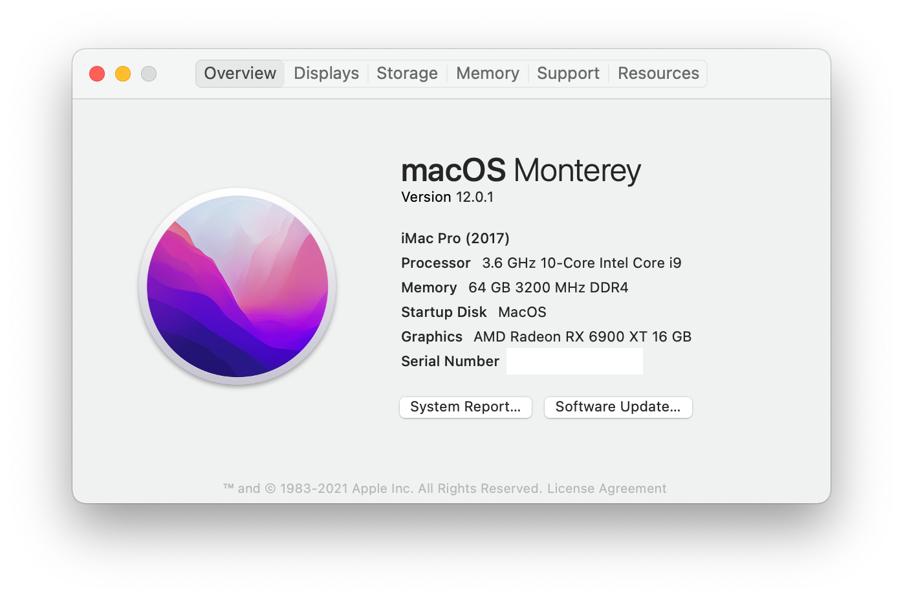
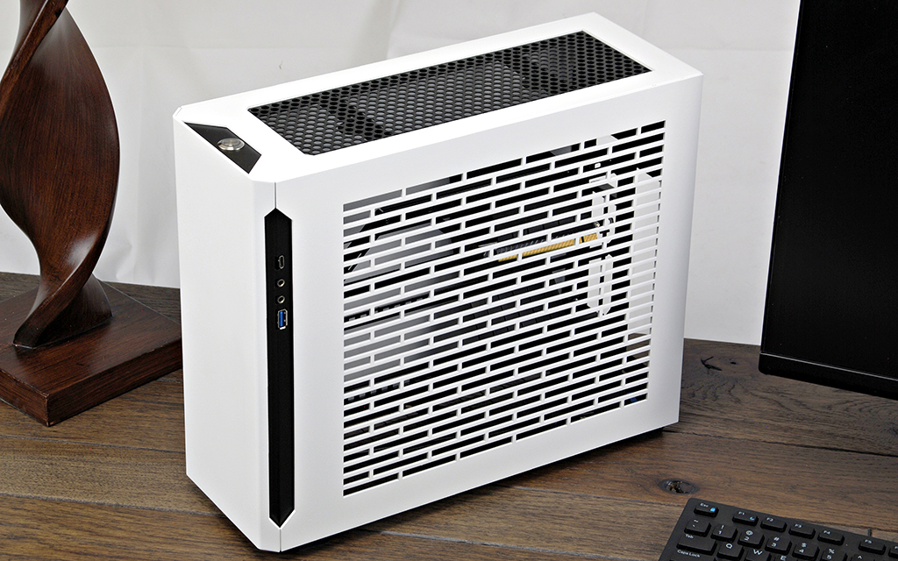
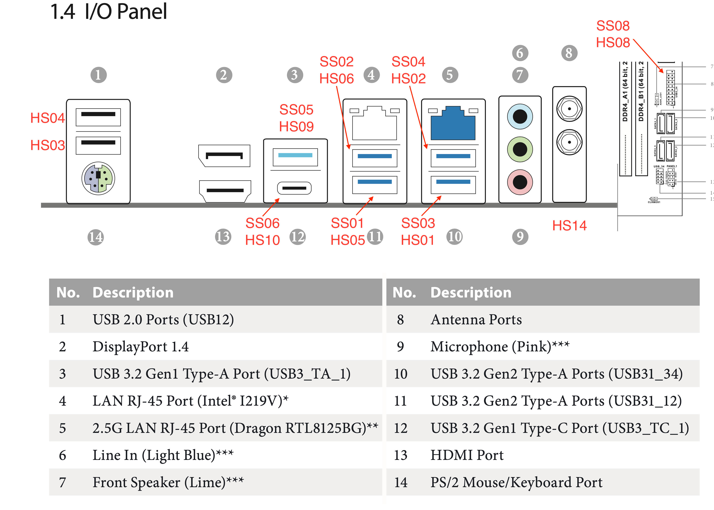

Hackintosh on ASRock Z490M-ITX-ac i9-10850K Gigabyte Radeon 5700XT based on [Open Core 0.6.6](https://github.com/acidanthera/OpenCorePkg/releases/tag/0.6.6)

## Hardware config

* Motherboard: [ASRock z390M-ITX-ac](https://www.amazon.com/ASRock-Z490M-ITX-Supports-Processors-Motherboard/dp/B087TDGDP7)
* CPU: [Intel Core i9 10850K](https://www.amazon.com/Intel-i9-10850K-Desktop-Processor-Unlocked/dp/B08DHRG2X9)
* CPU cooler [EK 240mm AIO D-RGB All-in-One Liquid CPU Cooler](https://www.amazon.com/gp/product/B0842Z9WYG) with [Noctua NF-F12x15 PWM](https://www.amazon.com/Noctua-NF-F12-PWM-4-Pin-Premium/dp/B00650P2ZC)
* GPU: [Gigabyte Radeon RX5700 XT](https://amzn.to/2V30710)
* RAM: [Crucial Ballistix 3200 MHz DDR4 DRAM Desktop Gaming Memory Kit 64GB CL 16](https://www.amazon.com/Crucial-Ballistix-Desktop-Gaming-BL2K32G32C16U4R/dp/B083TSJ8N4)
* Case: [SM570	Mini-ITX PC Case](https://www.sliger.com/products/cases/sm570/)
* SSD: [Sabrent 2TB Rocket NVMe 4.0 Gen4 PCIe M.2 Internal SSD](https://www.amazon.com/Sabrent-Internal-Extreme-Performance-SB-ROCKET-NVMe4-2TB/dp/B07TN1MNJ4)
* WiFI: [BroadCom BCM94360CS2] (https://amzn.to/30YB6bd) with [NGFF adapter](https://amzn.to/2YR2u8f)

## Images

## What Works
* iMessage
* WiFi/Bluetooth
* Sleep/Wake
* AirDrop/Continuity/Unlock with Apple watch
* Shutdown etc.
* Audio 

## What doesn't work
* Cable management
* Additional case fans

## Thanks and Credits to:
https://dortania.github.io/OpenCore-Install-Guide/

